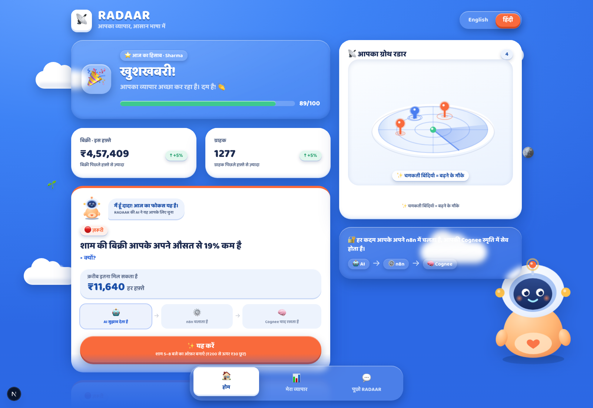
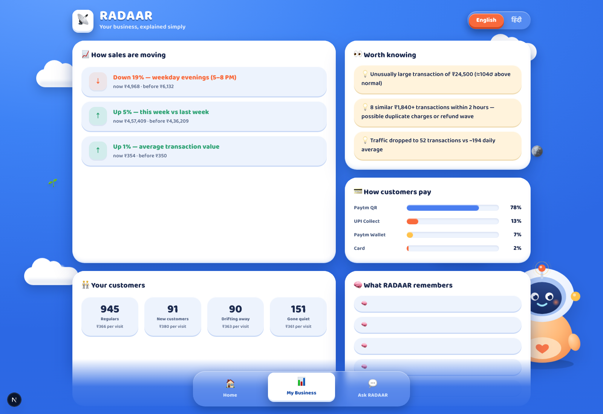
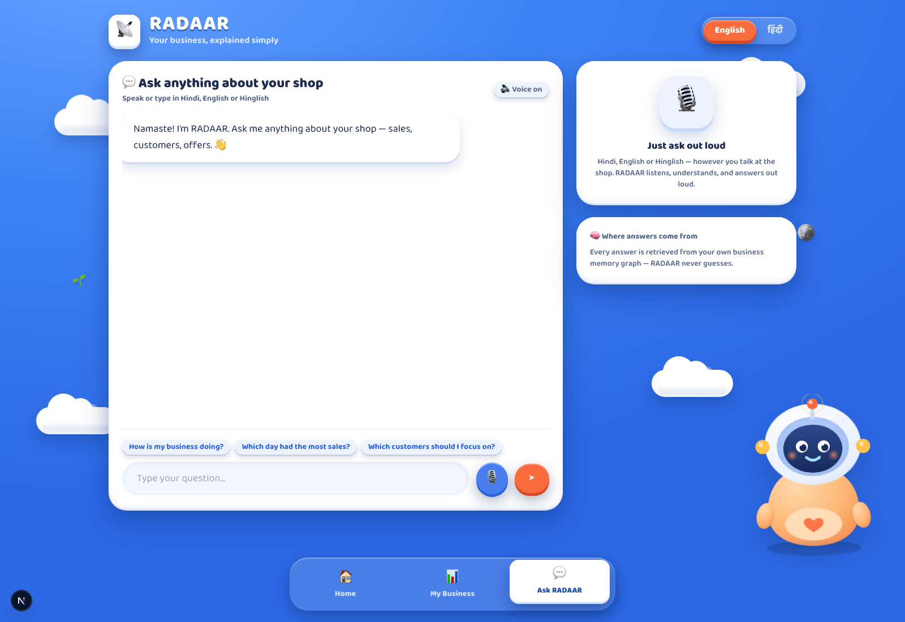

<div align="center">

# 📡 RADAAR

### **आपके व्यापार का साथी — Your business is talking. RADAAR tells you what it's saying.**

**The merchant-facing RADAAR**: a calm, warm, two-language app for the shopkeeper
who has **data everywhere but answers nowhere**. No dashboards to decode. No
jargon. Just: *is my business doing well?* (🎉 or ⚠️), *what is the one thing to
do today?*, and *an AI partner you can ask, in Hindi or English, out loud.*

`हिंदी` · `English` · 🎙️ Voice · 🧠 Cognee memory · ⚙️ n8n workflows · 🗣️ Sarvam voice & language

</div>



---

## The problem (from the merchant's chair, not the analyst's)

Sharma General Store does **₹4.6 lakh a week** across 1,200+ customers on Paytm
QR, UPI, wallet and card. What does Sharma actually get today? Charts. Graphs.
Percentages. English labels.

What Sharma actually asks on the way to the shop:

| The question in Sharma's head | What a dashboard gives instead |
|---|---|
| *"मेरा व्यापार ठीक चल रहा है?"* | A revenue line chart |
| *"कल क्या करूँ?"* | Seven tabs of metrics |
| *"यह कमज़ोरी कितने की है?"* | A cohort retention grid |
| *"पिछली बार कुछ ऐसा किया था, उससे क्या मिला था?"* | Nothing. No memory. |

The gap was never data. **The gap is interpretation, in the merchant's
language, with a memory.** Every analytics tool answers "what happened".
Merchants need "so what should *I* do, and will you remember it worked?"

## The solution: three tabs, two numbers, one action

RADAAR (this build) refuses to show more than a **phone-shaped handful of
things** at once:

- **🏠 होम** — a mood first: **"🎉 खुशखबरी! आपका व्यापार अच्छा कर रहा है"** in
  green, or **"⚠️ ध्यान दें"** in red. Then exactly two numbers (weekly sales,
  customers served), your **growth radar**, and **one focus card**: what's
  happening, why, and **क़रीब इतना मिल सकता है ₹7,330 हर हफ़्ते** — a rupee
  value, not a percentage.
- **📊 मेरा व्यापार** — the same intelligence, still in plain language: trends
  as arrows, "worth knowing" events, regulars vs one-time customers, payment
  mix, and **what RADAAR remembers**.
- **💬 पूछो RADAAR** — talk or type in Hindi, English or Hinglish. Answers come
  **grounded in the merchant's own memory graph** (badged **"🧠 Cognee स्मृति
  से"**), and are spoken aloud. Ask something that isn't in the data and RADAAR
  **says so instead of inventing it**.

Everything on screen toggles **हिंदी ⇄ English** instantly, including the AI's
suggested questions. The bottom navigation is **fixed**: three pebbles, always
one thumb-tap away, no scrolling to find them.

| होम (Hindi) | मेरा व्यापार (English) | पूछो RADAAR |
|---|---|---|
|  |  |  |

More views: [home in English](docs/screenshots/home-en.png) ·
[business in Hindi](docs/screenshots/business-hi.png) ·
[chat in Hindi](docs/screenshots/chat-hi.png)

---

## The loop: AI recommends → n8n runs → Cognee remembers

Every action card carries the pipeline **on its face**, so the merchant (and the
judge) can see the machinery as it fires:

> 🤖 **AI सुझाव देता है** → ⚙️ **n8n चलाता है** → 🧠 **Cognee याद रखता है**

1. **Detect** — deterministic engines read 90 days of transactions and surface
   the few things worth acting on, each priced in ₹.
2. **Act** — the merchant taps **✨ यह करें**. The app triggers the merchant's
   **n8n** workflow, which calls **Sarvam** to write the WhatsApp nudge
   (*"नमस्ते! शाम 5 से 8 बजे तक ₹200 से ऊपर की खरीदारी पर ₹30 की छूट पाएं। जल्दी आएं!"*),
   and files the dispatch into **Cognee** memory. The stepper ticks green as
   each system completes, with a live link **"इसे अपने n8n में लाइव देखें"**.
3. **Measure** — a few seconds of simulated time later, the measured revenue
   delta flows back through n8n: **🎉 काम बना! +₹36,135 · +8%**.
4. **Remember** — the outcome is written into the merchant's Cognee graph, so
   tomorrow's recommendation is grounded in **what actually worked for this
   store**. That compounding memory is the product.

## Architecture

```
                    ┌────────────────────────────────────────────────┐
                    │            THE MERCHANT'S PHONE / DESKTOP       │
                    │   होम · मेरा व्यापार · पूछो RADAAR   (हिंदी/EN)  │
                    └───────┬────────────────────────┬───────────────┘
                            │ REST                   │ 🎙 mic / 🔊 audio
                            ▼                        ▼
        ┌───────────────────────────────────────────────────────────────┐
        │                    NEXT.JS APP  (this repo, :3001)            │
        │                                                               │
        │  lib/generate.ts   synthetic Paytm-style 90-day ledger        │
        │  lib/engines.ts    trends · anomalies · churn · segments      │
        │  lib/insights.ts   → priced action cards (₹, not %)           │
        │  lib/friendly.ts   the "no jargon survives" translation layer │
        │  lib/hi.ts         mirrored Hindi templates for engine copy   │
        │  lib/session.tsx   language · tab · per-card offer state      │
        └──────┬─────────────────────┬─────────────────────┬───────────┘
               │                     │                     │
     POST /api/offer     POST /api/outcome        /api/copilot · /api/stt · /api/tts
               │                     │                     │
               ▼                     ▼                     ▼
┌──────────────────────────┐ ┌──────────────────────┐ ┌─────────────────────────┐
│ ⚙️ N8N (merchant's own)  │ │ ⚙️ N8N               │ │ 🗣️ SARVAM               │
│ radaar-offer-dispatch    │ │ radaar-outcome-loop  │ │ sarvam-105b  answers    │
│  → Sarvam writes nudge   │ │  → computes verdict  │ │ saarika:v2.5 mic→text   │
│  → Cognee: OFFER fact    │ │  → Cognee: OUTCOME   │ │ bulbul:v3   text→voice  │
└───────────┬──────────────┘ └──────────┬───────────┘ └─────────────────────────┘
            │                           │
            ▼                           ▼
┌──────────────────────────────────────────────────┐
│ 🧠 COGNEE — dataset  radaar_merchant_memory      │
│ INSIGHT / OFFER DISPATCHED / OFFER OUTCOME facts │
│ ← chat answers are GROUND here (or "I won't      │
│   invent it") — never freestyle                  │
└──────────────────────────────────────────────────┘
```

**Two orchestrators, one truth.** The app can trigger n8n, and everything either
orchestrator does is written to the same Cognee dataset. The copilot answers
from that graph first (badged `🧠 Cognee स्मृति से`) and only falls back to the
live snapshot facts (badged `● लाइव आँकड़ों से`) when the graph is unreachable.
There is no path where it freestyles.

## Tech stack, and why each piece

| Layer | Choice | Why this and not anything else |
|---|---|---|
| App | **Next.js 15 + React 19 + TS** | One server for UI + APIs + the pipeline; type-safe data contracts end to end |
| Styling | **Tailwind + claymorphic CSS** | Soft-3D depth (raised bases, press physics) with zero runtime cost; 2D that *feels* 3D |
| Radar | **Canvas 2D drawn in perspective** | The dish is the brand. A true-3D scene needed WebGL juggling for what a perspective ellipse, pin blips and a sweeping beam express perfectly — and it renders instantly on a ₹6,000 phone |
| i18n | **Own dictionary + mirrored Hindi templates** | Engine sentences (the card copy) carry *computed numbers*, so a string table alone can't translate them. `lib/hi.ts` rebuilds each sentence around the same numbers in natural Hindi |
| Data | **Seeded synthetic ledger** | 90 days of believable Paytm-pattern behavior (weekday evenings dip, weekend rush, churn cohorts, refund bursts), reproducible per merchant seed — honest about being synthetic, architecturally identical to a real feed |
| Detection | **Deterministic TS engines** | Every ₹ figure on screen is computed and re-computable, never LLM-invented. The AI *explains and writes*; math stays math |

## ⚙️ What n8n does here (and how to see it)

n8n is **the merchant's action layer** — RADAAR doesn't do things *to* the
merchant; it triggers workflows **in the merchant's own automation**, which they
can open, edit and watch.

| Workflow (deployed by `npm run pipeline`) | Triggered when | What happens inside n8n |
|---|---|---|
| **radaar-ingest-detect** | daily snapshot POST | IF action needed → **Sarvam** writes the Hinglish nudge → **Cognee** files the INSIGHT fact |
| **radaar-offer-dispatch** | merchant taps यह करें | builds the delivery manifest → **Cognee** files OFFER DISPATCHED → returns the nudge the UI renders as a WhatsApp mock |
| **radaar-outcome-loop** | measured result arrives | computes the verdict (worked / underperformed) + lesson → **Cognee** files OFFER OUTCOME → the learning loop, living in the merchant's n8n |

**The proof of seriousness:** nothing was hand-built in the n8n UI. `npm run
pipeline` uses the **n8n public API** to list → delete-by-name → create →
**activate** all three workflows from code (`lib/n8n-workflows.ts`), then fires
every webhook end-to-end and prints the Cognee receipt. Idempotent; run it
whenever you want a clean demo state.

**To see it live:** run `npm run pipeline`, open your n8n cloud instance →
Workflows (three green toggles) → tap **यह करें** in the app → Executions shows
the run with the real Sarvam output and Cognee write.

## 🧠 What Cognee does here (and how to see it)

Cognee is **the merchant's memory** — dataset `radaar_merchant_memory` — and the
reason the copilot can't hallucinate.

- **Write path**: typed facts (MERCHANT PROFILE, TREND, ANOMALY, SEGMENT,
  INSIGHT, **OFFER DISPATCHED**, **OFFER OUTCOME**) as deterministic text
  facts → `POST /api/v1/add` → `cognify` builds the graph. Offer and outcome
  facts are written *by the n8n workflows* — two writers, one memory.
- **Read path**: the copilot probes the graph with CHUNKS; when the data is
  there it answers via GRAPH_COMPLETION and wears the **"🧠 Cognee स्मृति से"**
  badge. When it isn't: *"यह मेरी स्मृति में नहीं है"* — it refuses to invent.
- **Compounding**: outcomes re-enter the graph, so recommendations get grounded
  in this store's real history. The **मुझे क्या याद है** list on मेरा व्यापार
  shows the memory as actually stored.

**To see it live:** `npm run pipeline` (resets + cognifies + proves grounding by
retrieving facts it wrote moments earlier), or open the Cognee console → your
tenant → dataset `radaar_merchant_memory` → graph view. Then ask the chat
**"पिछले ऑफ़र का क्या नतीजा आया?"** and watch the answer cite facts.

## 🗣️ What Sarvam does here (and how to see it)

The merchant's **language is the product**. Sarvam covers the entire loop, with
three models:

| Model | Where | Doing what |
|---|---|---|
| **sarvam-105b** | app copilot | answers in the language asked (Hindi / English / Hinglish), grounded in Cognee or the live snapshot |
| **sarvam-105b** | inside n8n workflows | writes the WhatsApp nudge in native Devanagari, ≤160 chars, from this store's own numbers |
| **saarika:v2.5** | `/api/stt` | mic → transcript + detected language |
| **bulbul:v3** | `/api/tts` | speaks every answer; voice auto-switches hi-IN/en-IN by script |

**To see it live:** on पूछो RADAAR, tap the mic and ask
**"इस हफ़्ते सबसे ज़्यादा बिक्री किस दिन हुई?"** — saarika transcribes, the
copilot grounds the answer, bulbul speaks it back in Hindi. No English
interface ever appears. (Browsers record webm/opus which saarika rejects, so
the client converts mic audio to 16 kHz PCM WAV in-browser — `lib/wav.ts`.)

## Run it (step by step)

```bash
# 1 · install
cd paytm
npm install

# 2 · secrets — copy the template and fill the real values
#     (never committed: .env* is gitignored)
cp .env.example .env
#   → COGNEE_API_KEY, COGNEE_BASE_URL, COGNEE_TENANT_ID, COGNEE_USER_ID
#   → N8N_BASE_URL, N8N_API_KEY
#   → SARVAM_API_KEY

# 3 · one command sets up the cloud side:
#     deploys + activates the 3 n8n workflows via the n8n API,
#     resets + cognifies the Cognee dataset, verifies Sarvam,
#     then proves the whole loop end-to-end
npm run pipeline          # wait for ✅ END-TO-END COMPLETE

# 4 · the app (port 3001, so it can run beside any other build)
npm run dev               # → http://localhost:3001

# 5 · click path for a demo
#   होम → read the mood → tap ✨ यह करें (watch the AI → n8n → Cognee stepper)
#   → नतीजा देखें → 🎉 काम बना! → मेरा व्यापार → see the new memory rows
#   → पूछो RADAAR → mic → "इस हफ़्ते सबसे ज़्यादा बिक्री किस दिन हुई?"
```

Useful extras: `npm run demo` (generates + explains one merchant snapshot in the
terminal) · `npm run typecheck` · deep links `?lang=hi|en` and
`?tab=home|business|chat` (used for the screenshots above, handy for demos).

## Design: why it looks like this

The reference is a claymorphic kids-entertainment UI, and we stole its
**psychology**, not its audience: a saturated **azure canvas** (blue = the color
of trust and banking), **soft-3D clay objects** lit from the top-left (things
that look touchable feel simple), a **mascot** — दादा (DADA), a little robot
whose head is a radar dish — who introduces the day's focus like a person, not
an alert system, and **one orange accent** reserved for the primary action.
Strict data discipline underneath the warmth: two numbers on home, one focus
card, everything else one tap away on its own tab. The radar is drawn as the
classic icon — perspective dish, sweeping beam, pin blips with ping rings —
because that is the image the product's name promises.

## Repository map

```
paytm/
├── app/
│   ├── page.tsx            # shell: header, language toggle, fixed 3-tab bar, DADA
│   ├── globals.css         # trust-blue clay design system (card3d, btn3d, tabstone…)
│   └── api/
│       ├── snapshot/       # generated merchant snapshot
│       ├── offer/          # → n8n radaar-offer-dispatch
│       ├── outcome/        # → n8n radaar-outcome-loop
│       ├── copilot/        # Cognee-grounded, Sarvam-answered chat
│       ├── stt/ · tts/     # Sarvam saarika / bulbul voice loop
│       └── memory/         # what RADAAR remembers (graph + local audit log)
├── components/
│   ├── HomeView.tsx        # mood greeting · two numbers · radar · focus cards + stepper
│   ├── BusinessView.tsx    # plain-language business detail
│   ├── ChatView.tsx        # bilingual voice chat with grounded badge
│   ├── RadarDish.tsx       # the 2D-drawn-3D radar (the brand)
│   └── Mascot.tsx          # दादा, the clay robot
├── lib/
│   ├── generate.ts · engines.ts · insights.ts   # the intelligence spine
│   ├── friendly.ts · hi.ts · i18n.ts            # the no-jargon bilingual layer
│   ├── session.tsx         # language/tab state, per-card offer flow
│   ├── n8n.ts · n8n-workflows.ts                # programmatic n8n deployment
│   ├── cognee.ts · memory-log.ts                # memory client + audit trail
│   └── sarvam.ts · wav.ts  # Sarvam clients + browser audio conversion
├── lib/demo.ts · lib/pipeline.ts                # one-command end-to-end proof
├── docs/screenshots/                            # the images in this README
├── PROGRESS.md                                  # decision log
└── README.md
```

## Honest notes

- **The data is synthetic** (seeded, reproducible, Paytm-patterned). Every
  engine, workflow and memory contract runs unchanged against a real Paytm
  transaction feed — it's a schema swap, not an architecture change.
- **The final WhatsApp send is mocked** in n8n; everything up to it (Sarvam
  copy, Cognee memory, verdict computation) is live sponsor infrastructure.
- **One active offer per card** (per-card state), measured outcomes simulated
  over compressed time so the full loop demos in a minute.

---

<div align="center">

**RADAAR** · built on **n8n** · **Cognee** · **Sarvam** · for Paytm merchants
*क्या हुआ → क्यों → अब क्या करें → कितना मिलेगा*

</div>
